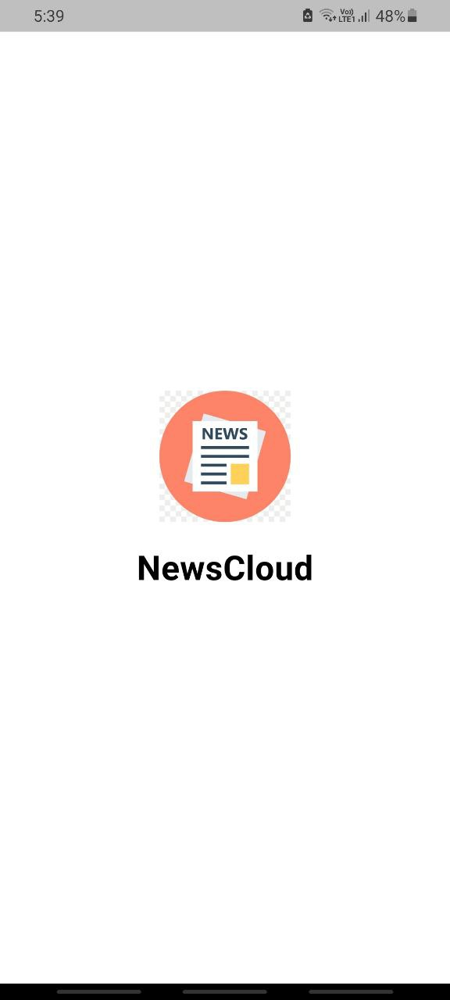
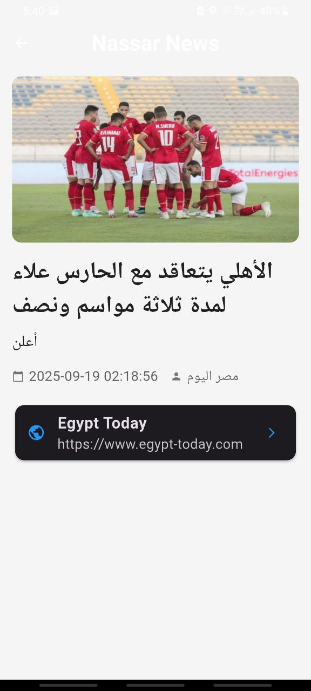

# 🌍 NewsCloud – Flutter News App

🚀 A beautifully crafted **Flutter news application** that brings the latest headlines straight to your fingertips.
NewsCloud is designed with **dark/light theme support**, a **modern UI**, and **category-based news browsing** to keep you updated in style.

---

## ✨ Features

✅ **Splash Screen** – Smooth app launch with branding
✅ **Dark & Light Themes** – Switch instantly with a single tap
✅ **Category-Based News** – Explore Business, Sports, Politics, Health, Science, Tech & more
✅ **Latest Headlines** – Powered by [NewsData.io](https://newsdata.io)
✅ **Detailed News Viewer** – Read full articles with images, date, author & source
✅ **Responsive UI** – Optimized for mobile devices with Flutter’s modern design
✅ **Error Handling** – Graceful fallbacks for missing images or data

---

## 📸 Screenshots

| Splash Screen                            | Home (Light)                                 | Home (Dark)                                 |
| ---------------------------------------- | -------------------------------------------- | ------------------------------------------- |
|  |  |  |

| Category View                              | News Details                              | News Details (Expanded)                        |
| ------------------------------------------ | ----------------------------------------- | ---------------------------------------------- |
|  |  |  |

---

## 🛠️ Tech Stack

* **Framework**: Flutter (Dart)
* **State Management**: Provider
* **Networking**: Dio
* **API**: [NewsData.io](https://newsdata.io)
* **UI**: Material Design with custom theming

---

## 📂 Project Structure

```
lib/
 ├── components/        # Reusable UI components
 ├── models/            # Data models (Article, Category)
 ├── services/          # API services with Dio
 ├── theme/             # Theme provider (Dark/Light mode)
 ├── views/             # Screens (Home, Category, NewsViewer, Splash)
 └── main.dart          # App entry point
```

---

## ⚡ Getting Started

1. **Clone the repo**

   ```bash
   git clone https://github.com/your-username/news_app_nassar.git
   cd news_app_nassar
   ```

2. **Install dependencies**

   ```bash
   flutter pub get
   ```

3. **Run the app**

   ```bash
   flutter run
   ```

---

## 🔑 API Key Setup

This app uses **NewsData.io API**.
Replace the API key inside `news_service.dart` with your own:

```dart
'https://newsdata.io/api/1/latest?apikey=YOUR_API_KEY&country=eg&category=$category'
```

You can generate a free key here 👉 [https://newsdata.io/register](https://newsdata.io/register)

---

## 🌗 Theme Showcase

* **Light Mode**: Clean white interface with black text
* **Dark Mode**: Modern black interface with white text
* Toggle theme instantly with the **app bar button** 🌙☀️

---

## 🚀 Future Improvements

🔹 Bookmark articles for offline reading
🔹 In-app browser to read full news
🔹 Multi-language support 🌐
🔹 Push notifications for breaking news

---

## 👨‍💻 Author

**Abdelrahman Atef Mohamed Nassar**
📧 [atef18008@gmail.com](mailto:atef18008@gmail.com)
🔗 [LinkedIn](https://www.linkedin.com/in/Abdelrahman-Nassar-dev253)
💻 [GitHub](https://github.com/Abdelrahmannassar10)

---

## ⭐ Support

If you like this project, don’t forget to **star ⭐ the repo** and share it with your friends!

👉 Do you also want me to add **GitHub-style badges** (Flutter SDK version, Dio, Provider, License, API used) at the very top of the README to make it look even more professional?
